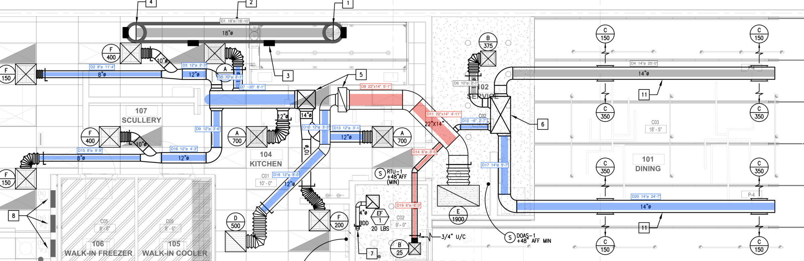

# hvac-duct-annotator

`ductmark` reads an HVAC mechanical plan PDF. For each duct run it finds the run, reads its size label and measures its length from the drawing scale. It writes three files:
- an annotated PDF
- a PNG of the same page
- a CSV takeoff



Colour shows the system: blue is supply, red is return, grey is unclassified. Each tag reads `id · size · straight length`. A dashed line means the size was measured from the drawing, because the run has no size label.

## Setup

Requires Python 3.10–3.12 (`rapidocr-onnxruntime` declares `<3.13`) and [uv](https://docs.astral.sh/uv/).

```bash
uv sync
```

With plain pip: `pip install .` in a 3.10–3.12 environment.

## Usage

```bash
uv run ductmark samples/testset2.pdf -o out
uv run ductmark drawing.pdf --page 2 --scale "1/8\"=1'-0\""
```

| Option | Default | |
|---|---|---|
| `-o, --out` | `out` | output directory |
| `--page` | `0` | 0-based page index |
| `--scale` | inferred | e.g. `1/4"=1'-0"`, `1"=20'`, `1:50` |
| `--dpi` | `150` | PNG resolution |

Outputs, for an input named `<stem>.pdf`:

- `<stem>_annotated.pdf`: the original sheet with the overlays and a legend.
- `<stem>_annotated.png`: a render of the same page.
- `<stem>_ducts.csv`:
  - `id`, `system`, `size`, `shape`, `width_in`, `length_ft`, `length`
  - `source`: `label`, `inferred` or `measured`
  - `label_text`: the raw OCR string
  - the run's centerline in page points

## How it works

The sample is a Bluebeam-flattened AutoCAD export. Its duct walls are exact vector lines. The size labels (`12"ø`, `22"X14"`) and the scale are SHX glyphs drawn as strokes, so they are not in the text layer. The pipeline therefore takes geometry from the vectors and reads text with OCR, and each check confirms the other.

1. **Segments** (`vector.py`)
   - Rotation is baked into the page first, so extraction, rendering and overlays share one coordinate frame.
   - Straight stroked edges come from lines, rectangles and quads.
   - Only dark strokes are kept, because MEP work is drawn black over a screened-grey architectural background.
2. **Walls to runs** (`geometry.py`)
   - Near-parallel segments 4–80 pt apart are paired over the interval where they overlap. One long wall can therefore pair with several opposite walls, which handles transitions and tees.
   - These pairs are rejected:
     - overlaps shorter than twice the gap: flex ribs, grille louvres, symbol boxes;
     - pairs with another parallel wall between them: the outer walls of two adjacent ducts.
   - Collinear pieces of the same width are merged across dampers and branch openings.
3. **Reading sizes** (`ocr.py`, `labels.py`)
   - The PDF text layer is used when it contains size labels. Otherwise the page is OCR'd at 300 dpi:
     - long strokes are erased so glyphs no longer touch duct walls;
     - glyph-sized blobs are joined into words;
     - each word is deskewed from its minimum-area rectangle, so horizontal, vertical and diagonal labels are all read upright;
     - RapidOCR's recogniser runs on each word, without its detector.
   - The parser accepts the ways OCR misreads SHX text. The ø can come back as `0`, `o` or `g`, and the inch mark can be dropped. The measured wall gap decides between readings: `120` inside a duct 12" wide is `12"ø`.
4. **Scale**: taken from `--scale`, or inferred. Inference tries each standard architectural and engineering scale and picks the one under which the most labels match their wall gaps. On the sample, 14 label/run pairs agree at 1/4"=1'-0" (1.5 pt per real inch), and no other scale gets more than 2.
5. **Confirm and grow** (`pipeline.py`)
   - A run is kept when a nearby label agrees with its measured width.
   - Connected runs of the same width inherit that size (`inferred`).
   - Connected runs of a different width are kept with their measured width (`measured`) only if they pass all of these:
     - the same lineweight as confirmed ducts;
     - long enough;
     - not part of a flex-rib stack;
     - not the gap between, or a piece inside, accepted ducts.
   - Everything else is dropped. This is what keeps table borders, walls and equipment outlines out of the result.
6. **Supply/return** (`classify.py`)
   - Boxes with corner-to-corner diagonals are air-device and riser symbols: an X means supply, a single diagonal means return.
   - Symbols that touch a run end (risers, inline boxes) seed that run's system, which then spreads through the connection graph.
   - Devices hung off flex sit too far from their branch to attach reliably, so runs no touching symbol reaches stay `unclassified`.
7. **Length**: the straight centerline length of each run at the drawing scale. Elbows, flex and fittings are not included.

## Results on the sample

`samples/testset2.pdf` (sheet M2.0) takes about 15 s on a laptop CPU, most of it OCR.

- **Scale:** inferred as 1/4"=1'-0".
- **Runs:** 20 in total:
  - 13 confirmed by their own label;
  - 5 that inherited a size from a connected run;
  - 2 kept with a measured width: the 20" kitchen trunk and a 6" connector, neither of which carries a label.
- **Size labels:** all 13 labels on detected runs are read and matched correctly. Labels on elbows, flex and short collars are not used, because those pieces are not measured.
- **Systems:** 13 supply, 4 return, 3 unclassified. The 18"ø grease duct is unclassified, which is correct: it is kitchen exhaust. Its length is 18'-10".
- **Nothing is marked** in the title block, the notes or the architectural background.

## Limitations

- **Vector PDFs only.** Scanned or rasterised drawings would need a raster wall detector; this tool has none.
- **Straight runs only.** Lengths exclude elbows, flex and fittings. A straight stub shorter than about twice its width is not detected, so on the sample some short collars at tees are missing.
- **Colour assumption.** Ductwork is assumed dark on a lighter background. Sheets that draw ducts in colour or grey need `max_luma` in `vector.dark_segments` adjusted.
- **Label placement.** A label must sit inside its duct, or within about 12 pt of it with an explicit size mark. Labels at the end of a long leader line are not associated.
- **Rectangular ducts.** For `22"x14"` only the plan dimension can be checked against geometry; the depth comes from the label alone.
- **Supply/return is a heuristic.** It depends on symbol conventions, not the air-device schedule.
  - On the sample, two runs are left unclassified: the upper 14" dining duct and a 10" riser. Their connecting stubs are too short to be detected as runs.
  - The 12"ø diagonal to grille D/500 is marked supply because it connects to the supply network, although that grille's single-diagonal symbol suggests return.
  - Reliable classification needs the schedule sheet or layers that encode the system.
- **Other gaps:** dashed (hidden or existing) ductwork is not detected, and one page is processed per run.

## Tests

```bash
uv run pytest               # all tests, ~20 s
uv run pytest -m "not slow" # skip the full OCR run on the sample
```

- Unit tests cover:
  - wall pairing on synthetic geometry: transitions, adjacent ducts, flex ribs, liners, diagonals;
  - run merging and connectivity;
  - label and scale parsing, including real OCR strings from the sample;
  - symbol classification.
- `tests/test_sample.py` checks the known runs on the sample drawing and the full takeoff.

## Dependencies

- PyMuPDF: vector extraction, rendering and PDF output. It is licensed AGPL-3.0; commercial use needs a license from Artifex.
- NumPy and OpenCV: geometry and image processing.
- `rapidocr-onnxruntime`: PP-OCRv4 models on ONNX Runtime, CPU only. The models ship inside the package, so no download is needed at run time.
